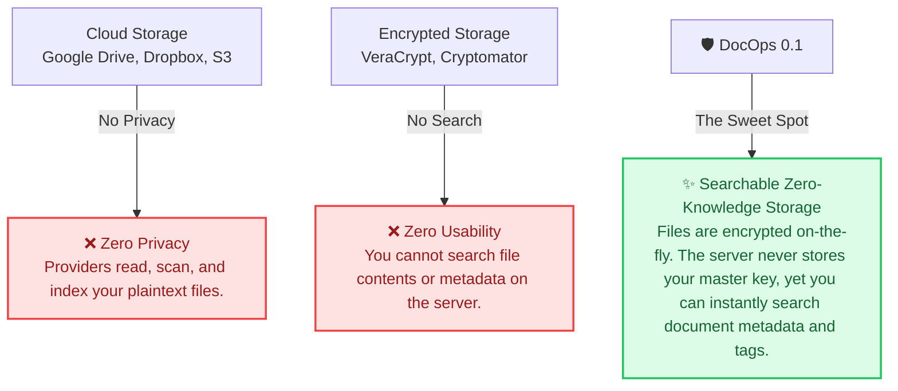
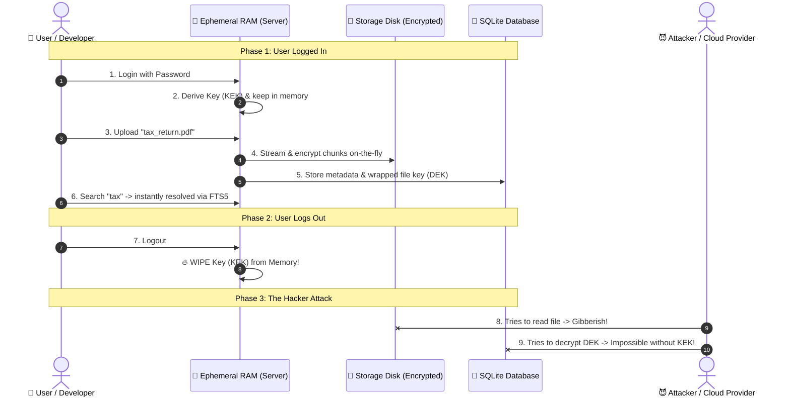

# How to Sell DocOps 0.1: The Simplified Pitch Strategy

To sell a highly technical, early-stage (v0.1) project that addresses a problem no one else has solved in this specific way, you must **bridge the gap between extreme privacy and extreme convenience**. 

If you talk too much about cryptographic implementation (Argon2id, AES-256-GCM chunked streams), you will lose 90% of your audience. If you talk only about "storage," people will tell you to just use Google Drive or S3.

You must focus on the **"Searchable Privacy" Paradox** and explain how DocOps gives them the best of both worlds.

---

## 🎯 The Core Philosophy: Resolving the Privacy-Search Paradox

Until now, developers and self-hosters faced a frustrating compromise:

---

## 💬 The Elevator Pitches (Tailored to Your Audience)

Depending on who you are talking to, use one of these three simplified pitches.

### 1. The 10-Second Pitch (For Twitter/X or Quick Demos)
> *"DocOps is a self-hostable document API that encrypts your files before they hit the disk, but still lets you search them instantly. It's like having your own private, zero-knowledge Google Drive API."*

### 2. The 30-Second Pitch (For Hacker News, Reddit, or Pitch Decks)
> *"Most cloud storage forces you to trust a third party with your files, while typical encryption tools make it impossible to search your documents. **DocOps is the missing middle.** It's a self-hostable, multi-tenant API that does chunked, zero-knowledge encryption in transit, but uses a temporary session key in RAM to let you query and search your metadata. You bring your own storage; DocOps keeps it completely secure."*

### 3. The 1-Minute Pitch (For a YouTube demo or Product Hunt intro)
> *"Imagine you are building a SaaS or managing sensitive personal files. If you dump them in an S3 bucket, a single leaked credential exposes everything in plaintext. If you encrypt them locally, your application can no longer search or filter them. *
> 
> *DocOps solves this. When a user logs in, their password derives a temporary Key Encrypting Key (KEK) that lives **only** in the server's ephemeral RAM. When they upload a file, DocOps streams it through a 64KB chunked AES-GCM pipeline, encrypts it on the fly, and writes it to your storage provider. The actual decryption key is wrapped with their KEK and saved. *
> 
> *When they log out, the key is wiped from RAM. Your files on disk remain absolute gibberish. Yet, while they are logged in, they can perform blazing-fast full-text searches. It's private, lightweight, written in Go, and runs anywhere."*

---

## 📊 The "Unfair Advantage" Comparison Matrix

When people ask, *"Why don't I just use Nextcloud or standard S3 encryption?"* show them this table.

| Feature | S3 / Google Drive | Nextcloud / OwnCloud | Cryptomator / VeraCrypt | 🔐 DocOps 0.1 |
| :--- | :---: | :---: | :---: | :---: |
| **Self-Hostable** | ❌ (Partially for S3 local) | ✅ | ✅ (Files only) | **✅ Yes** |
| **Server-Side Search** | ✅ | ✅ | ❌ | **✅ Yes (SQLite FTS5)** |
| **Zero-Knowledge** | ❌ | ❌ (Server has keys) | ✅ | **✅ Yes (Keys in RAM only)** |
| **Developer-First API** | ✅ | ❌ (Heavy, complex XML/WebDAV) | ❌ (Desktop tool) | **✅ Yes (Sleek JSON REST API)** |
| **Memory Footprint** | N/A | ❌ High (PHP/Java heavyweight) | ❌ High (Desktop client) | **✅ Ultra-lightweight Go (< 15MB RAM)** |

---

## 🚀 How to Launch and Build Hype (Even in v0.1)

Since DocOps is in **alpha (v0.1)** and doesn't have a GUI or cloud connectors yet, your primary audience is **developers, self-hosters, and privacy advocates**. They do not mind APIs or CLI interfaces—in fact, they prefer them!

Here is your exact community-by-community launch playbook.

### 🏢 Community 1: Reddit (`r/selfhosted`, `r/golang`, `r/netsec`)
Reddit self-hosters care about data ownership, resource usage, and clean architectures.

*   **Suggested Post Title:** 
    > *Show r/selfhosted: I built DocOps — a lightweight, zero-knowledge encrypted document API in Go with server-side full-text search. No keys are ever saved to disk.*
*   **Introductory Post Template:**
    > Hi everyone! 
    > 
    > I wanted a way to store my sensitive documents (tax returns, IDs, business receipts) in my own storage buckets without exposing the raw plaintext to my hosting provider or S3. But every time I encrypted them, I lost the ability to search or tag them easily.
    > 
    > So I built **DocOps** (v0.1) in Go. It's a lightweight, self-hostable REST API that uses envelope encryption. 
    > 
    > **How it works simply:**
    > 1. You log in -> a temporary key (KEK) is derived in RAM using Argon2id. It is **never** written to disk.
    > 2. You upload -> DocOps streams the file, encrypts it on-the-fly in 64KB chunks (so memory usage is constant), and stores the encrypted blob.
    > 3. Your database gets an encrypted file key (DEK). 
    > 4. You search -> DocOps queries its SQLite FTS5 index safely scoped by your user ID.
    > 5. You logout -> The key is instantly wiped from server RAM. The files on disk are completely unreadable gibberish.
    > 
    > It's open-source, written in pure Go (SQLite FTS5), uses less than 15MB of RAM, and includes a full suite of automated tests. 
    > 
    > S3/GCS connectors and PDF/DOCX content extraction are next on the roadmap. I'd love to hear your thoughts on the architecture!
    > 
    > GitHub: [Kyei-Ernest/DocOps](https://github.com/Kyei-Ernest/DocOps)

---

### 📰 Community 2: Hacker News (`Show HN`)
Hacker News readers love clean technical explanations, security audits, and interesting design choices.

*   **Suggested Title:** 
    > *Show HN: DocOps – Self-Hostable, Zero-Knowledge Searchable Document API in Go*
*   **Key points to emphasize in the comment:**
    *   **Envelope encryption structure:** Keep it technical but readable. Explain the KEK/DEK relationship.
    *   **Streaming performance:** Mention that chunked streaming prevents RAM spikes during large uploads.
    *   **The Go choice:** Built with standard libraries where possible, using a Chi router and SQLite FTS5.
    *   **Transparency:** Ask for architectural feedback on the session management and KEK derivation.

---

### ⚡ Community 3: Product Hunt (When you hit v0.5 or v1.0)
Wait until you have:
1. At least one cloud connector (S3 or Google Drive).
2. A simple, beautiful web UI (even a 1-page dashboard to upload/download/search documents).

When launching on Product Hunt, focus on the **no-code and low-code developers** who want to add secure document vaults to their own SaaS apps in seconds.

---

## 🎨 Visualizing the Flow: The "Wow" Factor

To make the idea instantly understandable on GitHub or social media, use this simplified diagram in your README or post. It proves to the user that **the server is blind to their data once they log out**.

---

## 🗺️ Pitch-Driven Roadmap: What to Build Next to Sell Easier

To make the project sell itself even faster, prioritize these three high-impact, highly visible features:

1.  **A Simple "Playground" Web UI**:
    *   An API is great for developers, but a 1-page React/Vue/Vanilla JS dashboard that lets users drag-and-drop a file, type a search query, and see it decrypt in real-time will make the value proposition **instantly clickable and viral**.
2.  **S3 Connector (BYO Storage)**:
    *   "Local disk" storage makes it feel like a toy. "Bring Your Own S3 Bucket" makes it feel like an enterprise-grade secure backup system.
3.  **Deploy-in-One-Click**:
    *   Add a `docker-compose.yml` file and a "Deploy to Render/Railway" button. If developers can spin up their own DocOps instance in 60 seconds, they will use it.
