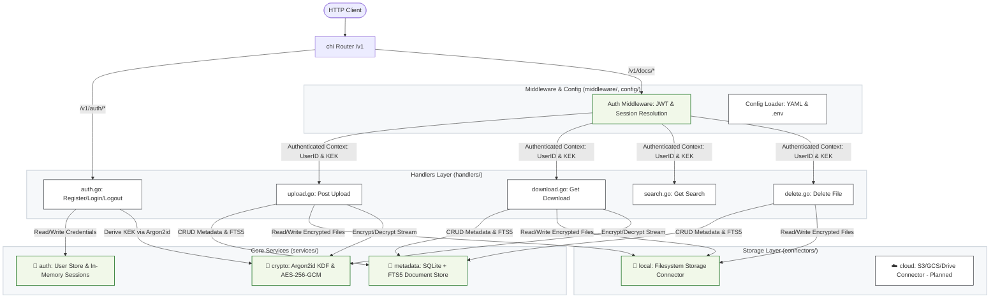

<p align="center">
  <h1 align="center">🔐 DocOps</h1>
  <p align="center">
    <strong>Self-hostable encrypted document storage API</strong>
  </p>
  <p align="center">
    Encrypt, upload, and search documents through a single API — backed by your own storage provider.
  </p>
  <p align="center">
    <a href="#quickstart"><strong>Quickstart</strong></a> ·
    <a href="#features"><strong>Features</strong></a> ·
    <a href="#api-reference"><strong>API</strong></a> ·
    <a href="#configuration"><strong>Config</strong></a> ·
    <a href="#contributing"><strong>Contributing</strong></a>
  </p>
</p>

<br/>

<p align="center">
  
  
  
  
</p>

---

## Why DocOps?

Most document storage solutions force you to trust a third party with your plaintext files. DocOps takes a different approach: **your files are encrypted before they ever leave the server**, using keys derived from your password that are never persisted to disk.

- **Zero-knowledge encryption** — files are encrypted with per-document keys; the server never stores your master key
- **Bring your own storage** — local disk today, S3/GCS/Google Drive on the roadmap
- **Full-text search** — search across document names, tags, and extracted text via SQLite FTS5
- **Multi-tenant by default** — every query is scoped by user; document isolation is enforced at the database layer

> [!NOTE]
> DocOps is in **active development (alpha)**. The core encryption, auth, upload/download, and storage layers are built and tested. Cloud connectors and text extraction are coming next.

---

## Features

| Feature | Status | Description |
|:---|:---:|:---|
| 🔑 Envelope encryption | ✅ | Per-document AES-256-GCM keys, wrapped by a user-derived KEK |
| 🔒 Argon2id auth | ✅ | Password hashing + KEK derivation with independent salts |
| 🍪 JWT sessions | ✅ | HttpOnly/Secure cookies with access (15m) + refresh (7d) tokens |
| 🔍 Full-text search | ✅ | SQLite FTS5 with trigger-synced index |
| 📤 File upload | ✅ | Multipart upload with chunked streaming encryption (64 KB) |
| 📥 File download | ✅ | DEK unwrap + chunked streaming decryption to client |
| 💾 Local storage | ✅ | Filesystem connector with streaming I/O |
| ⚙️ YAML config | ✅ | Sensible defaults, `.env` for secrets |
| 🛡️ Auth middleware | ✅ | JWT → session → KEK resolution per request |
| 👥 Multi-tenant | ✅ | All operations scoped by `user_id` |
| 🗑️ File deletion | ✅ | Secure delete from both storage connector and metadata DB |
| ☁️ Cloud connectors | 🚧 | S3, GCS, Google Drive |
| 📝 Text extraction | 🚧 | PDF/DOCX content extraction for search indexing |

---

## Architecture



---

## Security Model

DocOps uses **two-layer envelope encryption** so that compromising any single component does not expose plaintext documents:

<div style="border: 1px solid #d0d7de; border-radius: 6px; padding: 16px; font-family: sans-serif; background-color: #f6f8fa; margin: 16px 0;">
  <table style="width: 100%; border-collapse: collapse; text-align: center;">
    <tr>
      <td style="width: 25%; padding: 8px; border: 1px solid #d0d7de; background-color: #ffffff; border-radius: 4px;">
        <strong>User Password</strong>
      </td>
      <td style="width: 10%; font-size: 20px; color: #57606a;">➔</td>
      <td style="width: 25%; padding: 8px; border: 1px solid #d0d7de; background-color: #ffffff; border-radius: 4px;">
        <strong>Argon2id KDF</strong>
      </td>
      <td style="width: 10%; font-size: 20px; color: #57606a;">➔</td>
      <td style="width: 30%; padding: 8px; border: 1px solid #d0d7de; background-color: #e8f5e9; border-radius: 4px;">
        <strong>Key Encrypting Key (KEK)</strong>
        <div style="font-size: 11px; color: #2e7d32; margin-top: 4px;">In-memory only, never persisted</div>
      </td>
    </tr>
    <tr>
      <td colspan="4" style="height: 20px;"></td>
      <td style="font-size: 20px; color: #57606a;">⬇</td>
    </tr>
    <tr>
      <td colspan="2" style="padding: 8px; border: 1px solid #d0d7de; background-color: #fff8e1; border-radius: 4px; text-align: left; font-size: 13px;">
        <strong>Per-Document Key (DEK)</strong>
        <div style="font-size: 11px; color: #b78103; margin-top: 4px;">Random 256-bit key per document</div>
      </td>
      <td style="font-size: 20px; color: #57606a;">➔</td>
      <td colspan="2" style="padding: 12px; border: 1px solid #d0d7de; background-color: #e3f2fd; border-radius: 4px; text-align: left;">
        <strong>DEK Encryption Flow</strong>
        <div style="font-size: 12px; margin-top: 4px; color: #0d47a1;">
          • Encrypted DEK is stored in SQLite Database<br>
          • Encrypted File Content is saved via the Storage Connector
        </div>
      </td>
    </tr>
  </table>
</div>

| Property | Guarantee |
|:---|:---|
| **KEK storage** | Never written to disk — lives in server memory for session duration only |
| **DEK uniqueness** | Fresh 256-bit random key per document |
| **Nonce reuse** | Each encryption call generates a fresh random nonce |
| **Password hash vs KEK** | Independent Argon2id derivations with separate salts |
| **JWT contents** | Opaque session token only — no key material in the token |
| **Session revocation** | Server-side session store; logout invalidates immediately |
| **Timing attacks** | Constant-time comparison for password verification |

---

## Quickstart

### Prerequisites

- **Go 1.25+**
- **CGO enabled** (required by `go-sqlite3`)
- **SQLite with FTS5** support (included in most distributions)

### Install & Run

```bash
# Clone
git clone https://github.com/Kyei-Ernest/DocOps.git
cd DocOps

# Set your JWT secret
echo 'JWT_SECRET=change-me-to-a-real-secret' > .env

# Build
make build

# Run
make run
```

The server starts on `http://localhost:8080` by default. No config file is required — sensible defaults are applied automatically.

### Run Tests

```bash
# All tests
go test -tags "fts5" -v ./...

# By package
make services_crypto_test       # 25 tests — encryption, hashing, KEK/DEK, streaming
make services_metadata_test     # 15 tests — document CRUD, FTS5 search, isolation
make handler_test               # 63 tests — auth, upload, download, search, delete handlers
make services_auth_user_test    #  2 tests — user persistence
make services_auth_session_test #  8 tests — session lifecycle, expiry
make auth_middleware_test        #  8 tests — JWT validation, context injection
make local_connector_test        #  7 tests — filesystem upload, download, delete
```

---

## API Reference

### Authentication

| Method | Endpoint | Description |
|:---|:---|:---|
| `POST` | `/v1/auth/register` | Create account — returns access + refresh cookies |
| `POST` | `/v1/auth/login` | Authenticate — returns access + refresh cookies |
| `POST` | `/v1/auth/refresh` | Exchange refresh cookie for new access cookie |
| `POST` | `/v1/auth/logout` | Revoke sessions and clear cookies |

### Documents

| Method | Endpoint | Description |
|:---|:---|:---|
| `POST` | `/v1/docs/upload` | Upload encrypted document (multipart/form-data) |
| `GET`  | `/v1/docs/{docID}/download` | Download and decrypt a document (streaming) |
| `GET`  | `/v1/docs/search?q={query}` | Full-text search across document metadata |
| `DELETE`| `/v1/docs/{docID}` | Securely delete document metadata and storage file |

#### Upload Request

```bash
curl -X POST http://localhost:8080/v1/docs/upload \
  -b cookies.txt \
  -F "file=@document.pdf" \
  -F "tags=legal,2026"
```

#### Upload Response

```json
{
  "id": "doc_a1b2c3d4-...",
  "name": "document.pdf",
  "file_type": "application/pdf",
  "size_bytes": 104857,
  "encrypted": true,
  "tags": "legal,2026",
  "created_at": "2026-05-12T14:00:00Z"
}
```

#### Download Request

```bash
curl -X GET http://localhost:8080/v1/docs/doc_a1b2c3d4-.../download \
  -b cookies.txt \
  -o document.pdf
```

The response streams the decrypted file with appropriate `Content-Type` and `Content-Disposition` headers. Decryption happens in 64 KB chunks — memory usage is constant regardless of file size.

#### Search Request

```bash
curl -X GET "http://localhost:8080/v1/docs/search?q=quarterly" \
  -b cookies.txt
```

#### Search Response

```json
[
  {
    "id": "doc_a1b2c3d4-...",
    "name": "quarterly-report.pdf",
    "file_type": "application/pdf",
    "encrypted": true,
    "size_bytes": 104857,
    "tags": "finance,2026",
    "created_at": "2026-05-12T14:00:00Z",
    "expires_at": null
  }
]
```

Search matches against document names, tags, and extracted text via the FTS5 index. Results are scoped to the authenticated user — cross-tenant results are never returned. Sensitive internal fields (`storage_key`, `encrypted_dek`, `extracted_text`) are omitted from the response.

#### Delete Request

```bash
curl -X DELETE http://localhost:8080/v1/docs/doc_a1b2c3d4-... \
  -b cookies.txt
```

#### Delete Response

Returns a `204 No Content` status with an empty body upon successful deletion from both the database and physical storage connector.

> [!IMPORTANT]
> All document endpoints require authentication. The auth middleware injects the KEK and user ID from the server-side session — no key material is ever sent by the client.

---

## Configuration

DocOps loads configuration in order of precedence:

1. **`config.yaml`** — optional; defaults applied if absent
2. **Environment variables** — secrets only (never committed to YAML)
3. **`.env` file** — convenience for local development

### `config.yaml`

```yaml
server:
  port: 8080
  read_timeout:  "30s"
  write_timeout: "30s"

storage:
  local:
    path: "./docops-data/files"

auth:
  access_token_ttl:  "15m"    # short-lived access tokens
  refresh_token_ttl: "168h"   # 7-day refresh tokens

database:
  path: "./docops-data/docops.db"

argon2:
  memory:      65536   # 64 MiB
  iterations:  3
  parallelism: 2
  key_length:  32      # 256-bit keys
  salt_length: 16      # 128-bit salts
```

### Environment Variables

| Variable | Required | Description |
|:---|:---:|:---|
| `JWT_SECRET` | **Yes** | HMAC-SHA256 signing key for JWTs. Use ≥ 32 random bytes. |

---

## Project Structure

```
DocOps/
├── main.go                     # Entry point
├── config.yaml                 # Runtime configuration
├── Makefile                    # Build & test targets
│
├── config/
│   └── config.go               # YAML + env loader, defaults, path resolution
│
├── models/
│   ├── config.go               # Config, ServerConfig, AuthConfig, Argon2Config
│   ├── document.go             # Document model (with encryption metadata)
│   ├── crypto.go               # EncryptParams, DecryptParams
│   └── storage.go              # UploadRequest, FileRef
│
├── services/
│   ├── crypto/
│   │   ├── crypto.go           # Argon2id, AES-256-GCM, KEK/DEK, streaming encrypt/decrypt
│   │   └── crypto_test.go      # 25 tests
│   ├── auth/
│   │   ├── users.go            # SQLite-backed UserStore
│   │   ├── users_test.go       #  2 tests
│   │   ├── session.go          # In-memory SessionStore with lazy expiry
│   │   └── session_test.go     #  8 tests
│   └── metadata/
│       ├── store.go            # Document CRUD + FTS5 search (user-scoped)
│       └── store_test.go       # 15 tests
│
├── middleware/
│   ├── auth.go                 # JWT → session → context middleware
│   └── auth_test.go            #  8 tests
│
├── handlers/
│   ├── auth.go                 # Register, login, refresh, logout
│   ├── auth_test.go            # 14 tests
│   ├── upload.go               # Encrypted file upload handler
│   ├── upload_test.go          # 12 tests — upload encryption, auth, edge cases
│   ├── download.go             # Streaming decrypt + download handler
│   ├── download_test.go        # 15 tests — decryption, auth, streaming, errors
│   ├── search.go               # Full-text search handler
│   ├── search_test.go          # 14 tests — FTS5 queries, isolation, field filtering
│   ├── delete.go               # Secure document delete handler
│   └── delete_test.go          #  9 tests — file deletion, auth, ownership verification
│
└── connectors/
    ├── connector.go            # StorageConnector interface
    └── local/
        ├── local.go            # Filesystem-backed connector
        └── local_test.go       #  7 tests
```

---

## Roadmap

- [x] File download handler with DEK decryption
- [x] Chunked streaming encryption/decryption (64 KB, constant memory)
- [x] Full-text search handler with FTS5 + sensitive field filtering
- [x] HTTP mux wiring and route registration
- [x] Secure file deletion (both connector and database layers)
- [ ] Cloud storage connectors (S3, GCS, Google Drive)
- [ ] Text extraction (PDF, DOCX) for search indexing
- [ ] Document expiry and TTL enforcement
- [ ] Rate limiting middleware
- [ ] Structured logging (slog)
- [ ] Docker image and Compose file
- [ ] OpenAPI specification

---

## Contributing

Contributions are welcome! Here's how to get started:

1. **Fork** the repository
2. **Create a branch** for your feature (`git checkout -b feat/my-feature`)
3. **Write tests** — the project maintains high test coverage by design
4. **Run the full suite** before submitting: `go test -tags "fts5" -v ./...`
5. **Open a Pull Request** with a clear description of your changes

### Development Notes

- CGO is required for SQLite — set `CGO_ENABLED=1`
- Use the `-tags "fts5"` build tag for all commands that touch the metadata store
- Secrets must come from the environment, never from config files
- All new database operations must include `user_id` scoping

---

## License

This project is licensed under the [MIT License](LICENSE).

---


