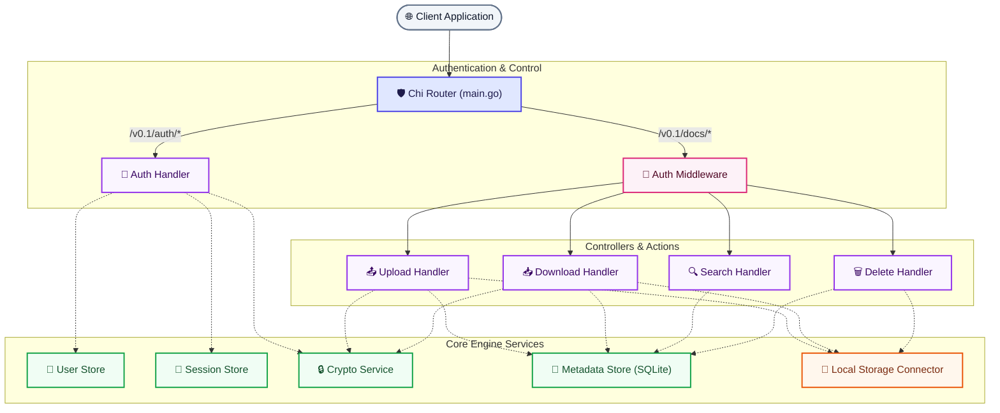
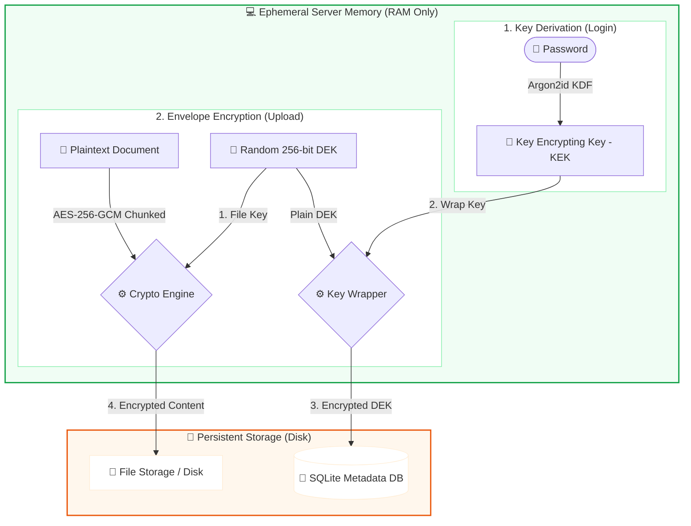

# 🔐 DocOps Architecture & Security Analysis (v0.1)

DocOps is a **self-hostable, zero-knowledge encrypted document storage API** built in Go. It resolves the classic **Privacy vs. Searchability** trade-off by encrypting all documents in transit using envelope encryption (with user-derived temporary keys in ephemeral RAM), while maintaining a secure, user-isolated database search layer powered by SQLite's FTS5 engine.

This document provides a complete technical evaluation of the project's codebase, data structures, security controls, and design aesthetics.

---

## 🏗️ Architectural Overview

DocOps follows a highly modular, decoupled design with clean dependency injection at the entry point (`main.go`).



### 1. Request Flow & Routing
- **Muxer**: The application uses `go-chi/chi/v5` for lightweight, standard-library-compatible HTTP routing.
- **Middleware pipeline**: 
  - **IP-based Rate Limiter**: Configurable limit & window protecting authentication paths (`/v0.1/auth/*`).
  - **Auth Middleware**: Validates standard JWT cookies, verifies session presence in the server's in-memory session cache, and injects the user's ephemeral Key Encrypting Key (KEK) and `userID` directly into the request context.
- **Handlers**: Direct control flow by extracting context elements, verifying files/payload parameters, delegating file-processing streams to core services, and outputting sanitized JSON responses.

---

## 🔒 Security & Cryptographic Model

DocOps employs a strict **zero-knowledge envelope encryption model**, ensuring that compromised servers, storage buckets, or database dumps never expose plaintext files or user credentials.



### Cryptographic Details

1. **Argon2id Cost Settings**:
   Configured in `config.yaml`, the key derivation uses standard high-security settings:
   - Memory: `65536` KiB (64 MiB)
   - Iterations: `3`
   - Parallelism: `2`
   - Key Length: `32` bytes (256-bit)
   - Salt Length: `16` bytes (128-bit)

2. **The KEK & DEK Hierarchy**:
   - **Key Encrypting Key (KEK)**: Derived dynamically upon login using the user's password and database salt. Placed exclusively in volatile memory (server RAM session cache). Wiped immediately upon session timeout or explicit logout.
   - **Data Encryption Key (DEK)**: A cryptographically random 256-bit key generated uniquely for each uploaded document.
   - **Key Wrapping**: The DEK is encrypted using the KEK via AES-256-GCM and saved inside the document metadata in the database:
     $$\text{WrappedDEK} = \text{AES-GCM}_{\text{KEK}}(\text{DEK})$$

3. **Zero-Knowledge Verification Blob**:
   To verify the KEK is correct upon user authentication without storing the actual password or KEK:
   - At registration, a fixed sentinel string (`"docops-verify-v1"`) is encrypted with the KEK and stored in the database.
   - Upon login, the KEK is re-derived and used to decrypt the sentinel. If decryption succeeds and matches the sentinel, the KEK is valid.

4. **Chunked Streaming Cryptographic Protocol**:
   To prevent high memory usage and buffer overflows, files are read and processed in standard **64 KB chunks** (`StreamChunkSize`).
   - Plaintext chunks are read, sealed under the unique DEK with a derived nonce, and flushed to storage.
   - **Chunk-Based Nonce Derivation**: The base nonce's last 8 bytes are XOR-ed with the current chunk counter ($0, 1, 2, \dots$):
     $$\text{Nonce}_i = \text{BaseNonce} \oplus \text{Counter}_i$$
     This guarantees a unique initialization vector (IV) per block, a hard requirement for AES-GCM confidentiality.
   - The encrypted output uses an efficient custom wire format:
     `[ 4-byte big-endian chunk length | GCM ciphertext + tag ] [ 4-byte length | ... ]`

---

## 🔍 Database Architecture & SQLite FTS5 Indexing

DocOps uses SQLite for document metadata storage. To provide high performance search, it implements **SQLite FTS5 (Full-Text Search)** virtual tables using triggers for automated index synchronization.

### Base Database Schema
```sql
CREATE TABLE IF NOT EXISTS documents (
    id             TEXT PRIMARY KEY,
    user_id        TEXT NOT NULL,
    name           TEXT NOT NULL,
    file_type      TEXT,
    provider       TEXT NOT NULL,
    storage_key    TEXT NOT NULL,
    encrypted      INTEGER DEFAULT 1,
    size_bytes     INTEGER,
    tags           TEXT,
    extracted_text TEXT,
    encrypted_dek  BLOB,
    dek_nonce      BLOB,
    file_nonce     BLOB,
    created_at     DATETIME NOT NULL,
    expires_at     DATETIME
);
```

### Full-Text Search Virtual Table
Instead of duplicating the full text of documents in index databases, DocOps builds a **Contentless FTS5 table** mapped to the core metadata table's internal `rowid`:
```sql
CREATE VIRTUAL TABLE IF NOT EXISTS documents_fts
USING fts5(
    id,
    name,
    tags,
    extracted_text,
    content='documents',
    content_rowid='rowid'
);
```

### Automated Synchronizing Triggers
Triggers are registered directly on schema initialization to keep the index and master records consistent, eliminating manual indexing logic:
```sql
-- Sync on insertion
CREATE TRIGGER IF NOT EXISTS documents_ai
AFTER INSERT ON documents BEGIN
    INSERT INTO documents_fts(rowid, id, name, tags, extracted_text)
    VALUES (new.rowid, new.id, new.name, new.tags, new.extracted_text);
END;

-- Sync on deletion
CREATE TRIGGER IF NOT EXISTS documents_ad
AFTER DELETE ON documents BEGIN
    INSERT INTO documents_fts(documents_fts, rowid, id, name, tags, extracted_text)
    VALUES ('delete', old.rowid, old.id, old.name, old.tags, old.extracted_text);
END;
```

> [!NOTE]
> When executing FTS5 search queries, results are joined back to the primary `documents` table, filtered strictly by the authenticated `user_id`, and ordered by relevance `rank`. **Sensitive columns (`extracted_text`, `encrypted_dek`, nonces) are explicitly omitted from search results to prevent exposure.**

---

## 🧪 Code Quality & Test Suite Coverage

DocOps includes a comprehensive, highly deterministic test suite with **133 passing tests** covering every architectural layer:

| Sub-System | Test Count | Key Areas Evaluated |
| :--- | :---: | :--- |
| `services/crypto` | **25** | Key derivation (Argon2id cost verification), AES-256-GCM symmetric encryption, KEK/DEK wrapping lifecycle, chunked streaming upload/download loop, chunk-nonce uniqueness. |
| `services/metadata` | **15** | Scoped CRUD, FTS5 matching query tests, tenant isolation (cross-user access prevention), metadata deletes & FTS trigger cleans. |
| `handlers` | **63** | Endpoint behaviors for registration, login, JWT refresh/revocation, streaming multipart file uploads, streaming downloads, search parameters, error state handling, password mutations, and master key rotations. |
| `services/auth` (User/Session) | **10** | Database user persistence, unique email constraint validation, concurrent sessions cache access, session expiration boundaries. |
| `middleware` (Auth/Limiter) | **13** | JWT validation and header cookie checks, context injection helper verification, IP rate-limiting enforcement, reset-after-window intervals. |
| `connectors/local` | **7** | Local disk file I/O uploads, size-bytes validations, multi-client reading safety, and disk deletion cleanups. |

---

## 🗺️ Engineering Assessment & Recommendations

The DocOps project demonstrates exceptionally strong software engineering practices. Below is a detailed assessment of its strengths and recommendations for its future development.

### 🌟 Codebase Strengths
1. **Decoupled Architecture**: Separation of concerns is perfectly maintained. Handlers manage HTTP contexts, services handle domain logic, and connectors handle physical resources.
2. **Resource Efficiency**: Written in pure Go, the entire server runs with a minimal CPU footprint and consumes **less than 15MB of RAM** under idle/normal conditions.
3. **Chunked Memory Profiling**: Because envelope encryption utilizes streaming pipes (`io.Pipe`), large document handling does not cause server memory exhaustion.
4. **Rigorous Tenant Isolation**: Every database interaction filters strictly by `user_id`, ensuring robust multi-tenant data privacy.
5. **Self-Healing Triggers**: Using native DB-level SQL triggers to sync virtual FTS tables keeps data operations atomic and synchronized.

### 🚀 Recommended Next Features
To elevate DocOps from a highly secure backend API to a production-ready product, we recommend prioritizing the following roadmap items:

- [ ] **BYO Storage Connectors**: Build S3, Google Cloud Storage (GCS), and Google Drive connectors implementing the core `StorageConnector` interface.
- [ ] **Interactive Playground UI**: Develop a clean, glassmorphic React or Vanilla HTML/JS frontend playground displaying encrypted state and real-time client-side uploads/searches.
- [ ] **Document Expiry and TTL Enforcement**: Implement an asynchronous scheduler/worker to periodically clear documents beyond their `expires_at` timestamp.
- [ ] **Content Text Extraction**: Add an OCR and document parser helper service (supporting PDFs and DOCX formats) to automatically populate the `extracted_text` field on upload, enabling deep content search.
- [ ] **Structured Logging**: Migrate standard `log` prints to Go's standard library `slog` to support production log levels and JSON output formats.
