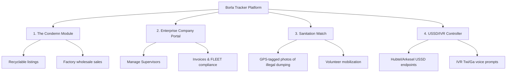

# 🚛 Borla Tracker — Gap Analysis & Product Roadmap

This document analyzes the gap between the **currently implemented features** in the Borla Tracker codebase and the **intended value propositions** outlined in the project's documentation (`SYSTEM_DOCUMENTATION.md` and `pitch_proposal.html`). 

---

## 🔍 Executive Summary: Current Implementation State

The codebase has a very robust foundation. Below is the status of the current implementation:

| Module | Backend Status | Frontend Status |
| :--- | :--- | :--- |
| **Authentication & Accounts** | ✅ Complete (JWT, Role-based, auto-generating sequential usernames) | ✅ Complete (Login, Register pages) |
| **Client Management** | ✅ Complete (Profile, multi-address with PostGIS points) | ✅ Complete (Dashboard, address management) |
| **Collector Management** | ✅ Complete (Profiles, offline/online states, tracking, ratings) | ✅ Complete (Collector dashboard, Available jobs, Live mode) |
| **Scheduled & On-Demand Pickups** | ✅ Complete (Zone-based pricing multipliers, auto-assignment engine) | ✅ Complete (New request form, detail and list views) |
| **Wallet & Digital Payments** | ✅ Complete (Paystack/MoMo integrations, balance ledgers) | ✅ Complete (Client/Collector wallet views) |
| **Real-time Map & Chat** | ✅ Complete (Go WebSocket service, Redis Pub/Sub, client keys) | ✅ Complete (Live maps and chat hooks) |
| **Supervision & Zones** | ✅ Complete (Geofences, supervisor routing) | ✅ Complete (Supervisor map, reports) |

---

## ⚠️ Major Feature Gaps (Vision vs. Code)

We have identified several critical features described in the **pitch proposal** or **system overview** that are **completely missing** from the actual codebase, along with additional recommendations to make this a premium, market-ready product.



---

### 1. The "Condemn" Module (Reverse Recyclables Marketplace)
The pitch proposal heavily highlights a **reverse scrap/recyclables marketplace** connecting households with informal scrap collectors ("Koko-men") and bulk recycling factories (e.g., Nelplast, Tema Steel Works).
*   **Backend Gap**: No models, views, or endpoints exist for scrap listings, weights, material categories (PET, LDPE, Iron, Aluminum), factory drop-offs, or wholesale commission processing.
*   **Frontend Gap**: No interface for clients to list scrap materials or for collectors to browse and bid on scrap pick-ups.
*   **Proposed Solution**:
    *   **Backend**: Create a `condemn` app with `ScrapListing`, `ScrapCategory`, and `FactorySale` models.
    *   **Frontend**: 
        *   **Client**: "Sell Recyclables" page inside [ClientDashboard.tsx](file:///home/ernest-kyei/Documents/my_python_projects/lets_django/borla_master/borla-frontend/src/pages/client/ClientDashboard.tsx) to list materials by category with estimated weight.
        *   **Collector**: "Scrap Marketplace" board inside [CollectorDashboard.tsx](file:///home/ernest-kyei/Documents/my_python_projects/lets_django/borla_master/borla-frontend/src/pages/collector/CollectorDashboard.tsx) to claim listings, enter weighed amounts, and initiate MoMo transfers to the client.

---

### 2. Full-scale Enterprise "Company" Portal
While a `Company` model is defined in the backend, the current frontend routes the `company` role directly to the `supervisor` dashboard.
*   **Backend Gap**: 
    *   The `Supervisor` model does not link directly to the `Company` model (it only stores `company_username` as a text field, which breaks foreign key relations).
    *   No APIs exist for a company to register and manage its own supervisors, view unified billing, or optimize fleet vehicle capacities.
*   **Frontend Gap**: There is **no dedicated company panel**. A waste management company cannot manage its operations, monitor multi-zone activities, or manage corporate clients.
*   **Proposed Solution**:
    *   **Backend**: Refactor `Supervisor.company` to be a `ForeignKey` to [Company](file:///home/ernest-kyei/Documents/my_python_projects/lets_django/borla_master/waste_management_company/models.py). Add endpoints for supervisor CRUD by company users.
    *   **Frontend**: Create a separate `/company` route prefix in the React routing tree [index.tsx](file:///home/ernest-kyei/Documents/my_python_projects/lets_django/borla_master/borla-frontend/src/routes/index.tsx) with a dashboard showing fleet utilization metrics, supervisor assignments, corporate billing status, and EPA permit renewals.

---

### 3. Community Environmental Watch ("Sanitation Watch")
A planned feature allowing citizens to report sanitation failures (choked drains, illegal landfill heaps) to trigger government or volunteer actions.
*   **Backend Gap**: No models for community reports or volunteer registration.
*   **Frontend Gap**: No reporting portal or community cleanup boards.
*   **Proposed Solution**:
    *   **Backend**: Create a `sanitation_watch` app with `EnvironmentalReport` (GPS, photo, description, severity, status) and `CleanupEvent` (event details, volunteer list, points rewarded) models.
    *   **Frontend**: 
        *   **Public/Client**: "Sanitation Watch" page to snap and upload GPS-tagged pictures of trash piles.
        *   **Volunteer Board**: Portal displaying upcoming cleanups where clients can sign up and earn "Eco-Points" redeemable for wallet cashbacks or airtime.

---

### 4. Telephony Integration (USSD & IVR Voice Flows)
To accommodate informal/illiterate collectors who do not use smartphones, the platform must support USSD (`*800#`) and localized Twi/Ga voice prompts.
*   **Backend Gap**: The backend is purely REST API. No USSD gateway controller or Twilio/Hubtel voice response views exist.
*   **Proposed Solution**:
    *   Create a `telephony` app containing endpoints like `/api/telephony/ussd/` and `/api/telephony/ivr/` that parse XML/JSON payloads from providers (like Hubtel, Arkesel, or Africa's Talking) and respond with menus for:
        *   Checking balance
        *   Accepting assigned routes
        *   Entering the client's 4-digit verification PIN to complete collections

---

### 5. Sanitation Services Directory ("Toilet Pullers")
A directory of liquid waste management services (septic desludging) described as a natural product expansion.
*   **Backend Gap**: No models or endpoints for septic service listings, provider ratings, or booking requests.
*   **Frontend Gap**: No interface for septic truck booking.
*   **Proposed Solution**:
    *   Create a `sanitation_directory` app with `SepticProvider` and `DesludgingBooking` models, allowing clients to book liquid waste removal directly from the app.

---

## 📈 Premium/Commercial Enhancements (Recommended)

To elevate Borla Tracker from a project to a premium, enterprise-grade platform:

### A. Dynamic Turn-by-Turn Navigation for Collectors
*   **Current State**: The collector map shows route stops but lacks navigation.
*   **Proposed Addition**: Integrate OSRM (Open Source Routing Machine) or Google Maps SDK into the collector's [CollectorLivePage.tsx](file:///home/ernest-kyei/Documents/my_python_projects/lets_django/borla_master/borla-frontend/src/pages/collector/CollectorLivePage.tsx) to provide real-time turn-by-turn driving directions between optimized stops.

### B. Gamification & Eco-Point Redemptions
*   **Current State**: `segregation_compliance_percent` is tracked, but not utilized.
*   **Proposed Addition**: Create an `IncentivesEngine` task. When a collector completes a pickup and rates the client's segregation compliance above 80%, award the client "Eco-Points". Add a rewards store to the client's [WalletPage.tsx](file:///home/ernest-kyei/Documents/my_python_projects/lets_django/borla_master/borla-frontend/src/pages/client/WalletPage.tsx) to redeem points for MoMo cashback or utility credits.

### C. IoT Smart Bin Integration (Corporate Offer)
*   **Current State**: Bins are purely static choices.
*   **Proposed Addition**: Create a `smart_bin` app with an endpoint (`POST /api/iot/bins/ping/`) for ultrasonic sensors. When a bin's fill level exceeds 85%, automatically dispatch an on-demand request, notifying both the client and the nearest active collector.

---

## 🛠️ Summary of Files to Modify / Create

To implement these features, the following structure is recommended:

```diff
# Backend (Django)
+ on_demand/api/iot_views.py           # Endpoint for smart bin sensors
+ waste_management_company/models.py  # Link Supervisor as ForeignKey instead of CharField
+ telephony/views.py                  # Hubtel/Arkesel USSD & IVR integration
+ condemn/models.py                   # ScrapListing, ScrapCategory, FactorySale
+ sanitation_watch/models.py          # EnvironmentalReport, CleanupEvent, Volunteer

# Frontend (React)
+ borla-frontend/src/pages/company/   # Dedicated WMC dashboards & fleet dispatching
+ borla-frontend/src/pages/condemn/   # Recyclable marketplace for clients & collectors
+ borla-frontend/src/pages/watch/     # Sanitation Watch reporting & volunteer signups
```
