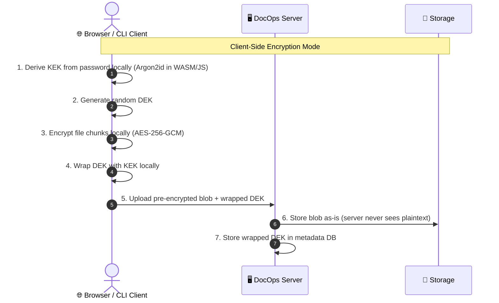
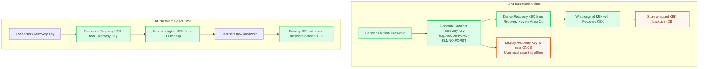
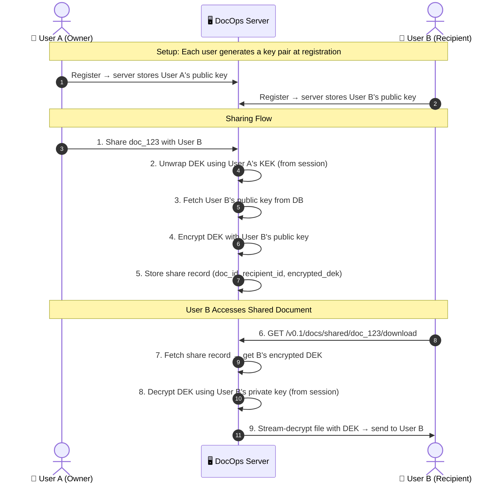

# Solving the 6 Downsides of DocOps v0.1

A practical, code-grounded guide for addressing each architectural limitation. Solutions are ordered by **impact vs. effort** — start with the quick wins (Problems 5 & 4), then tackle the structural ones.

---

## Problem 1: Server-Side Trust (Not True Client-Side Zero-Knowledge)

**The Risk:** The KEK lives in server RAM ([session.go:16](file:///home/ernest-kyei/GolandProjects/DocOps/services/auth/session.go#L14-L18)). A compromised server (root access, RAM dump) can steal active KEKs.

### Solution: Hybrid Client-Side Encryption Mode

Rather than rewriting everything, add an **optional** client-side encryption mode alongside the existing server-side mode. This lets API-only users keep the simple server-side flow, while security-conscious users (or browser-based clients) can opt into full client-side encryption.

### How It Works



### Implementation Strategy

#### A. Create a new endpoint for client-encrypted uploads

```go
// POST /v0.1/docs/upload-encrypted
// Accepts: pre-encrypted file blob + wrapped DEK + nonces
// The server stores them directly WITHOUT re-encrypting
```

The existing [upload handler](file:///home/ernest-kyei/GolandProjects/DocOps/handlers/upload.go) currently calls `crypto.EncryptStream()` to encrypt the file. The new endpoint would **skip** encryption entirely and store the pre-encrypted blob as-is.

#### B. Provide a JavaScript/WASM encryption SDK

Build a thin client library (`docops-client-sdk`) that:
1. Derives the KEK using Argon2id in the browser (via WebAssembly or the Web Crypto API)
2. Generates a random DEK
3. Encrypts the file using the same chunked AES-256-GCM format as [crypto.go:303](file:///home/ernest-kyei/GolandProjects/DocOps/services/crypto/crypto.go#L295-L343)
4. Wraps the DEK with the KEK
5. Sends the encrypted blob + wrapped DEK to the server

#### C. Keep backward compatibility

The existing server-side flow remains the default. The client-side mode is activated by a request header (e.g., `X-DocOps-Encryption: client`), and the server validates the format but never touches the plaintext.

### Effort: 🔴 High (3-4 weeks)
### Impact: 🟢 Very High — enables true zero-knowledge for paranoid users

---

## Problem 2: Search Index Leakage (Plaintext FTS5 Database)

**The Risk:** The [metadata store](file:///home/ernest-kyei/GolandProjects/DocOps/services/metadata/store.go#L40-L108) stores document names, tags, and `extracted_text` in plaintext SQLite. Anyone who steals `docops.db` can read the search index.

### Solution A: SQLCipher (Encrypt the Entire Database) — Recommended

**SQLCipher** is a drop-in replacement for SQLite that transparently encrypts the entire database file using AES-256-CBC. From Go's perspective, the only change is the driver import.

#### Implementation

1. **Swap the SQLite driver:**

```diff
# go.mod
- github.com/mattn/go-sqlite3 v1.14.42
+ github.com/mutecomm/go-sqlite3-compat v0.0.0  # SQLCipher-compatible driver
```

2. **Add the encryption key when opening the database:**

```go
// In metadata/store.go — New()
func New(dbPath string, encryptionKey string) (*Store, error) {
    // The pragma key must be set immediately after opening the connection
    dsn := fmt.Sprintf("%s?_pragma_key=%s", dbPath, url.QueryEscape(encryptionKey))
    db, err := sql.Open("sqlite3", dsn)
    // ...
}
```

3. **Derive the database encryption key from the server's JWT_SECRET:**

```go
// In main.go — use a KDF on the JWT_SECRET to produce a DB encryption key
dbKey := crypto.DeriveDBKey(cfg.JWTSecret)
metaStore, err := metadata.New(cfg.DatabasePath, dbKey)
```

> [!IMPORTANT]
> SQLCipher encrypts the **entire** database at rest. If the server process is running and has the database open, the data is still accessible in decrypted form in memory — this protects against disk theft, not a compromised running process.

### Solution B: Per-User Encrypted Search Index (Advanced)

For true per-user zero-knowledge search, you would need to implement **Searchable Symmetric Encryption (SSE)**:
- At upload time, the client generates encrypted keyword tokens using their KEK
- These tokens are stored in the database instead of plaintext
- At search time, the client generates a search token from their KEK + query
- The server matches tokens without knowing the actual keywords

This is academically elegant but extremely complex to implement correctly. **Recommend Solution A for v0.2-0.3, and consider Solution B for v1.0+.**

### Effort: 🟡 Medium (Solution A: 2-3 days, Solution B: 4-6 weeks)
### Impact: 🟢 High — eliminates the #1 criticism security engineers will raise

---

## Problem 3: SQLite Scaling & Single Point of Failure

**The Risk:** The in-memory [SessionStore](file:///home/ernest-kyei/GolandProjects/DocOps/services/auth/session.go#L27-L30) and single [SQLite file](file:///home/ernest-kyei/GolandProjects/DocOps/services/metadata/store.go#L20-L30) prevent horizontal scaling.

### Solution: Abstract the Storage Layer Behind Interfaces

The key insight is: **don't replace SQLite — abstract it.** Keep SQLite as the default for single-node self-hosting (your core audience), but allow power users to swap in PostgreSQL or Redis.

#### Step 1: Define Store Interfaces

```go
// services/metadata/store.go — extract an interface
type DocumentStore interface {
    Save(ctx context.Context, doc *models.Document) error
    GetByID(ctx context.Context, id, userID string) (*models.Document, error)
    Search(ctx context.Context, userID, query string) ([]*models.Document, error)
    Delete(ctx context.Context, id, userID string) error
    Close() error
}

// services/auth/session.go — extract an interface
type SessionRepository interface {
    Save(token string, session *Session)
    Get(token string) (*Session, bool)
    Delete(token string)
}
```

#### Step 2: Implement Redis-Backed Sessions (for Horizontal Scaling)

```go
// services/auth/redis_session.go
type RedisSessionStore struct {
    client *redis.Client
}

func (r *RedisSessionStore) Save(token string, session *Session) {
    // Serialize session (including KEK) and store in Redis with TTL
    data, _ := json.Marshal(session)
    r.client.Set(ctx, "session:"+token, data, session.ExpiresAt.Sub(time.Now()))
}
```

> [!WARNING]
> Storing KEKs in Redis means Redis becomes a high-value target. Use Redis with TLS, authentication, and ideally encrypt the KEK before storing it. This is a trade-off: you gain horizontal scaling but widen the attack surface.

#### Step 3: Add PostgreSQL Support for Metadata (Optional v1.0+)

For users who need multi-node deployments, implement a `PostgresStore` that satisfies the `DocumentStore` interface. PostgreSQL has its own full-text search capabilities that can replace FTS5.

#### Configuration-Driven Selection

```yaml
# config.yaml
database:
  driver: "sqlite"      # or "postgres"
  path: "./docops-data/docops.db"

sessions:
  driver: "memory"       # or "redis"
  redis_url: "redis://localhost:6379"
```

### Effort: 🟡 Medium (Interfaces: 1 day, Redis sessions: 2-3 days, Postgres: 1-2 weeks)
### Impact: 🟡 Medium — most self-hosters run single nodes, but this unblocks enterprise use

---

## Problem 4: Zero Password Recovery

**The Risk:** If a user forgets their password, their KEK is lost forever. All their encrypted documents become permanently unrecoverable.

### Solution: Recovery Key (Generated at Registration)

Generate a one-time **Recovery Key** at registration that the user must save offline (like a 2FA backup code). This key can re-derive or decrypt a backup copy of the KEK.

#### How It Works



#### Implementation in [handlers/auth.go](file:///home/ernest-kyei/GolandProjects/DocOps/handlers/auth.go)

1. **At Registration** — after [line 129](file:///home/ernest-kyei/GolandProjects/DocOps/handlers/auth.go#L129) where the KEK is derived:

```go
// Generate a 20-character recovery key (160 bits of entropy)
recoveryKey := generateRecoveryKey()  // e.g. "ABCDE-FGHIJ-KLMNO-PQRST"

// Derive a separate KEK from the recovery key
recoverySalt, _ := crypto.GenerateSalt()
recoveryKEK := crypto.DeriveKEK(recoveryKey, recoverySalt, h.params)

// Wrap the user's real KEK with the recovery KEK
wrappedKEK, wrapNonce, _ := crypto.WrapDEK(kek, recoveryKEK)

// Store wrappedKEK, wrapNonce, and recoverySalt in the users table
user.RecoveryWrappedKEK = wrappedKEK
user.RecoveryWrapNonce  = wrapNonce
user.RecoverySalt       = recoverySalt
```

2. **Return the recovery key in the registration response** (shown only once):

```go
w.WriteHeader(http.StatusCreated)
json.NewEncoder(w).Encode(map[string]string{
    "recovery_key": recoveryKey,
    "message":      "Save this recovery key offline. It cannot be shown again.",
})
```

3. **New endpoint** `POST /v0.1/auth/recover`:

```go
func (h *AuthHandler) Recover(w http.ResponseWriter, r *http.Request) {
    // Input: email + recovery_key + new_password
    // 1. Fetch user by email
    // 2. Re-derive recovery KEK from recovery_key + stored recovery salt
    // 3. Unwrap the original KEK using the recovery KEK
    // 4. Hash the new password
    // 5. Re-derive a new KEK from the new password + new salt
    // 6. Re-wrap original KEK with new KEK
    // 7. Update user record with new password hash, new KEK salt, new wrapped KEK
}
```

> [!TIP]
> This is the same approach used by **1Password**, **Bitwarden**, and **ProtonMail** for their master password recovery flows.

### Effort: 🟢 Low-Medium (2-3 days)
### Impact: 🟢 Very High — this is the #1 usability complaint users will have

---

## Problem 5: Argon2id DDoS Vulnerability

**The Risk:** Each login/register call triggers an expensive Argon2id derivation (64MB RAM, 3 iterations) at [auth.go:114](file:///home/ernest-kyei/GolandProjects/DocOps/handlers/auth.go#L114) and [auth.go:212](file:///home/ernest-kyei/GolandProjects/DocOps/handlers/auth.go#L212). An attacker flooding `/v0.1/auth/login` can exhaust server CPU and RAM.

### Solution: Multi-Layer Rate Limiting

Implement rate limiting **before** the Argon2id computation runs, so malicious requests are rejected cheaply.

#### Layer 1: IP-Based Rate Limiter (Middleware)

Add a new middleware in [middleware/](file:///home/ernest-kyei/GolandProjects/DocOps/middleware/):

```go
// middleware/ratelimit.go
package middleware

import (
    "net/http"
    "sync"
    "time"
)

type visitor struct {
    count    int
    lastSeen time.Time
}

type RateLimiter struct {
    mu       sync.Mutex
    visitors map[string]*visitor
    limit    int           // max requests per window
    window   time.Duration // time window
}

func NewRateLimiter(limit int, window time.Duration) *RateLimiter {
    rl := &RateLimiter{
        visitors: make(map[string]*visitor),
        limit:    limit,
        window:   window,
    }
    // Background cleanup of stale entries
    go rl.cleanup()
    return rl
}

func (rl *RateLimiter) Limit(next http.Handler) http.Handler {
    return http.HandlerFunc(func(w http.ResponseWriter, r *http.Request) {
        ip := r.RemoteAddr
        
        rl.mu.Lock()
        v, exists := rl.visitors[ip]
        if !exists || time.Since(v.lastSeen) > rl.window {
            rl.visitors[ip] = &visitor{count: 1, lastSeen: time.Now()}
            rl.mu.Unlock()
            next.ServeHTTP(w, r)
            return
        }
        v.count++
        v.lastSeen = time.Now()
        if v.count > rl.limit {
            rl.mu.Unlock()
            w.Header().Set("Retry-After", "60")
            http.Error(w, "rate limit exceeded", http.StatusTooManyRequests)
            return
        }
        rl.mu.Unlock()
        next.ServeHTTP(w, r)
    })
}
```

#### Layer 2: Apply Only to Auth Routes

In [main.go](file:///home/ernest-kyei/GolandProjects/DocOps/main.go#L96-L101):

```go
// Create a strict rate limiter for auth endpoints
authLimiter := middleware.NewRateLimiter(5, 1*time.Minute) // 5 attempts per minute per IP

r.Route("/v0.1/auth", func(r chi.Router) {
    r.Use(authLimiter.Limit)  // ← rate limit BEFORE any handler runs
    r.Post("/register", authHandler.Register)
    r.Post("/login", authHandler.Login)
    r.Post("/refresh", authHandler.Refresh)
    r.Post("/logout", authHandler.Logout)
})
```

#### Layer 3: Argon2id Concurrency Limiter (Bounded Worker Pool)

Even with IP rate limiting, a distributed botnet can bypass per-IP limits. Add a **global concurrency semaphore** to cap how many Argon2id derivations can run simultaneously:

```go
// services/crypto/crypto.go — add a semaphore
var argon2Semaphore = make(chan struct{}, 4) // max 4 concurrent Argon2id operations

func HashPasswordBounded(password string, p *models.Argon2Config) (string, error) {
    argon2Semaphore <- struct{}{}        // acquire slot (blocks if full)
    defer func() { <-argon2Semaphore }() // release slot
    return HashPassword(password, p)
}
```

This ensures that even under heavy load, the server uses at most `4 × 64MB = 256MB` of RAM for Argon2id, preventing OOM kills.

### Effort: 🟢 Low (1-2 days)
### Impact: 🟢 Very High — this is the easiest, highest-priority fix

---

## Problem 6: Complex Document Sharing

**The Risk:** User A's files are encrypted with User A's KEK. User B has a different KEK. There is no mechanism to share access without exposing key material.

### Solution: Per-Share Key Re-Wrapping

When User A shares a document with User B, the server:
1. Unwraps the document's DEK using User A's KEK (which is in RAM during their session)
2. Re-wraps the same DEK using User B's **public wrapping key**
3. Stores the re-wrapped DEK as a share record

#### Architecture



#### Database Changes

```sql
-- New table for share records
CREATE TABLE IF NOT EXISTS document_shares (
    id            TEXT PRIMARY KEY,
    document_id   TEXT NOT NULL REFERENCES documents(id) ON DELETE CASCADE,
    owner_id      TEXT NOT NULL,
    recipient_id  TEXT NOT NULL,
    encrypted_dek BLOB NOT NULL,   -- DEK re-wrapped with recipient's public key
    dek_nonce     BLOB NOT NULL,
    created_at    DATETIME NOT NULL,
    expires_at    DATETIME,         -- optional share expiry
    UNIQUE(document_id, recipient_id)
);
```

#### New API Endpoints

```
POST   /v0.1/docs/{docID}/share       — Share a document with another user
GET    /v0.1/docs/shared               — List documents shared with me
GET    /v0.1/docs/shared/{docID}/download — Download a shared document
DELETE /v0.1/docs/{docID}/share/{userID} — Revoke a share
```

> [!NOTE]
> The simpler alternative (no public-key crypto) is to re-wrap the DEK with User B's **symmetric KEK**. This requires User B to be logged in (KEK in RAM) at the moment of sharing. The public-key approach allows sharing even when User B is offline, but adds key-pair management complexity.

### Effort: 🔴 High (1-2 weeks)
### Impact: 🟡 Medium — important for collaboration, but DocOps v0.1 is primarily a personal vault

---

## 📋 Recommended Implementation Order

| Priority | Problem | Solution | Effort | Why First? |
| :---: | :--- | :--- | :---: | :--- |
| **1** | Argon2id DDoS | Rate limiting middleware | 1-2 days | Easiest fix, prevents server crashes |
| **2** | Zero Password Recovery | Recovery key at registration | 2-3 days | #1 usability complaint, prevents permanent data loss |
| **3** | Search Index Leakage | SQLCipher integration | 2-3 days | Closes the biggest security gap after the core encryption |
| **4** | SQLite Scaling | Extract store interfaces | 3-5 days | Enables future flexibility without changing behavior |
| **5** | Document Sharing | Share records + DEK re-wrapping | 1-2 weeks | High-impact feature but complex |
| **6** | Server-Side Trust | Client-side encryption SDK | 3-4 weeks | Architecturally significant; wait for v0.5+ |

> [!TIP]
> Problems 1 and 2 can be shipped as a **v0.2 release** within a single week, and they would dramatically improve the project's credibility when pitching to security-minded developers.
